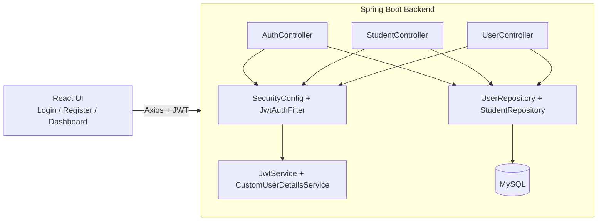

# Student Dashboard (Spring Boot + React) Architecture Overview

## 1) UI Screens

### Login Page
- Username + password form
- Calls `POST /auth/login`
- Stores `token`, `role`, and `username` in localStorage

### Register Page
- Username, password, confirm password
- Calls `POST /auth/register`
- Redirects user to login after success

### Dashboard
- Student list + filters + analytics cards
- Add / Edit / Delete student (ADMIN only)
- Student details drawer
- Average attendance + distribution insights

## 2) Backend Structure

### Controller Layer
- `AuthController` (`/auth/register`, `/auth/login`)
- `StudentController` (`/api/students` CRUD + average attendance)
- `UserController` (legacy/basic user endpoints)

### Security Layer
- `SecurityConfig` (JWT stateless auth + endpoint protection)
- `JwtAuthFilter` (reads `Authorization: Bearer <token>`)
- `JwtService` (token generation + validation)
- `CustomUserDetailsService` (loads user + roles)

### Persistence Layer
- `UserRepository`
- `StudentRepository`

### Entity Layer
- `User` (`id`, `username`, `password`, `role`)
- `Student` (`id`, `name`, `branch`, `studentYear`, `attendancePercentage`)
- `Role` enum (`ADMIN`, `STUDENT`)

## 3) Database Design

### Users Table
| Column | Type | Notes |
|---|---|---|
| id | BIGINT | Primary key, auto-generated |
| username | VARCHAR | Login identity |
| password | VARCHAR | BCrypt hash |
| role | VARCHAR | `ADMIN` or `STUDENT` |

### Students Table
| Column | Type | Notes |
|---|---|---|
| id | BIGINT | Primary key (manual input in current UI) |
| name | VARCHAR | Required |
| branch | VARCHAR | Required |
| student_year | INT | 1 to 4 |
| attendance_percentage | DOUBLE | 0.0 to 100.0 |

## 4) REST API Surface

### Auth
- `POST /auth/register`
- `POST /auth/login`

### Students
- `GET /api/students`
- `GET /api/students/{id}`
- `GET /api/students/average-attendance`
- `POST /api/students` (ADMIN)
- `PUT /api/students/{id}` (ADMIN)
- `DELETE /api/students/{id}` (ADMIN)

## 5) System Flow

1. User registers via `/auth/register` (default role: `STUDENT`).
2. User logs in via `/auth/login` and receives JWT.
3. Frontend sends JWT in `Authorization` header.
4. `JwtAuthFilter` validates token on protected routes.
5. Student data is read/written via JPA repositories.
6. Role checks (`@PreAuthorize`) enforce ADMIN-only mutations.

## 6) End-to-End Architecture Diagram (Mermaid)



## 7) Layered View (Reference-style)

```mermaid
flowchart TB
    UI[UI Layer\nLogin | Register | Dashboard]
    CTRL[Controller Layer\nAuthController | StudentController | UserController]
    SEC[Security Layer\nJWT Filter | JwtService | UserDetailsService]
    REPO[Repository Layer\nUserRepository | StudentRepository]
    DB[(MySQL Database\nusers, students)]

    UI --> CTRL
    CTRL --> SEC
    CTRL --> REPO
    REPO --> DB
```

## 8) Deployment Configuration Dependencies

Required backend env vars:
- `DB_URL`
- `DB_USERNAME`
- `DB_PASSWORD`
- `JWT_SECRET`
- `JWT_EXPIRATION_MS`
- `APP_CORS_ALLOWED_ORIGINS`
- `PORT`

Required frontend env var:
- `REACT_APP_API_BASE_URL`

---

This document is generated from the current repository implementation and is intended as your project reference sheet.
